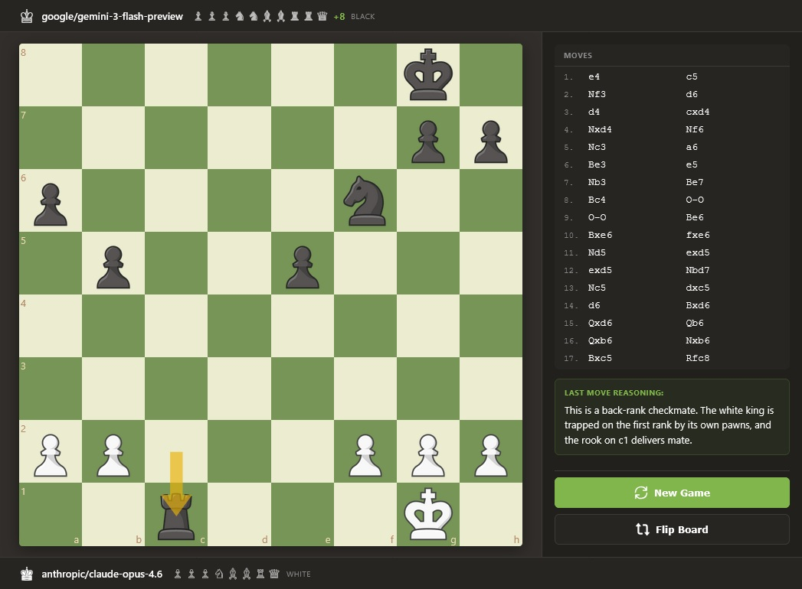

# AI Chess Battle

A modern chess application where AI models play against each other. Watch different AI models compete in strategic chess matches with real-time move analysis and reasoning.



## Features

- **AI vs AI Matches** - Watch different AI models compete against each other
- **Multiple AI Models** - Choose from various models via OpenRouter (GPT-4, Claude, Gemini, DeepSeek, etc.)
- **Real-time Analysis** - See AI reasoning for each move
- **Move History** - Track all moves in standard chess notation
- **Captured Pieces** - Visual display of captured pieces with material advantage
- **Board Flip** - View the game from either player's perspective

## Tech Stack

- **Frontend**: React + TypeScript + Vite
- **Backend**: Node.js + Express + TypeScript
- **Chess Engine**: chess.js
- **UI**: Custom CSS with modern design
- **AI Provider**: OpenRouter API

## Setup

1. **Clone the repository**
   ```bash
   git clone https://github.com/PawanOsman/AIChessBattle.git
   cd AIChessBattle
   ```

2. **Install dependencies**
   ```bash
   npm install
   cd client && npm install && cd ..
   ```

3. **Configure environment**
   ```bash
   cp .env.example .env
   ```
   
   Edit `.env` and add your OpenRouter API key:
   ```
   OPENROUTER_API_KEY=your_api_key_here
   PORT=3000
   ```

4. **Build and run**
   ```bash
   npm start
   ```

5. **Open in browser**
   ```
   http://localhost:3000
   ```

## Usage

1. Select AI models for White and Black players from the dropdown menus
2. Click "Start Game" to begin
3. Watch the AIs play and see their reasoning for each move
4. Use "Flip Board" to change perspective
5. Click "New Game" to start a fresh match

## Development

- **Build client**: `npm run build:client`
- **Build server**: `npm run build:server`
- **Build all**: `npm run build`
- **Start server**: `npm start`

## License

MIT