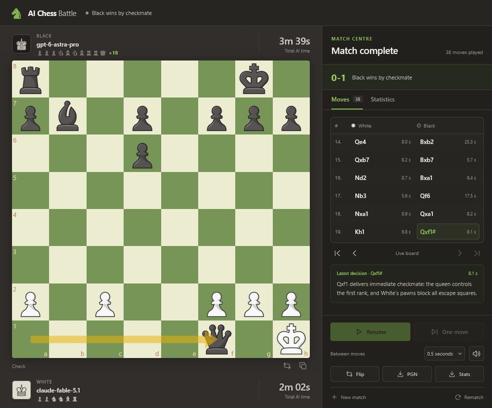

# AI Chess Battle

A modern chess application where AI models play against each other. Watch different AI models compete in strategic chess matches with real-time move analysis and reasoning.



## Features

- **AI vs AI Matches** - Watch different AI models compete against each other
- **Multiple AI Models** - Choose from various models via OpenRouter (GPT-4, Claude, Gemini, DeepSeek, etc.)
- **Real-time Analysis** - See AI reasoning for each move
- **Move History** - Track all moves in standard chess notation
- **Captured Pieces** - Visual display of captured pieces with material advantage
- **Board Flip** - View the game from either player's perspective

## Tech Stack

- **Frontend**: React + TypeScript + Vite
- **Backend**: Node.js + Express + TypeScript
- **Chess Engine**: chess.js
- **UI**: Custom CSS with modern design
- **AI Provider**: OpenRouter API

## Setup

1. **Clone the repository**
   ```bash
   git clone https://github.com/PawanOsman/AIChessBattle.git
   cd AIChessBattle
   ```

2. **Install dependencies**
   ```bash
   pnpm install
   ```

3. **Configure environment**
   ```bash
   cp apps/server/.env.example apps/server/.env
   ```
   
   Edit `.env` and add your OpenRouter API key:
   ```
   OPENROUTER_API_KEY=your_api_key_here
   PORT=3000
   ```

4. **Build and run**
   ```bash
   pnpm start
   ```

5. **Open in browser**
   ```
   http://localhost:3000
   ```

## Usage

1. Select AI models for White and Black players from the dropdown menus
2. Click "Start Game" to begin
3. Watch the AIs play and see their reasoning for each move
4. Use "Flip Board" to change perspective
5. Click "New Game" to start a fresh match

## Development

The repo is a pnpm workspace with two apps: `apps/server` (Express API) and `apps/client` (React/Vite UI). The client build is emitted to `apps/server/public` and served by the server.

- **Build client**: `pnpm run build:client`
- **Build server**: `pnpm run build:server`
- **Build all**: `pnpm run build`
- **Start server**: `pnpm start`
- **Run regression tests**: `pnpm test` with Node.js 24+ (mocked provider requests; no API credits used)

## AI move reliability

The server generates legal moves from the FEN with chess.js and constrains structured responses to one complete UCI move, including promotions. Every response is validated before it reaches the board. Model capability metadata selects strict JSON Schema, JSON mode, or a JSON-only prompt; explicit format incompatibility can trigger a bounded downgrade. No random or engine-selected move is substituted for a failed AI response.

There is one retry layer on the server, with three attempts by default, a 45-second per-request timeout, and a 120-second overall move deadline. Transient failures and invalid model outputs can retry; authentication and credit errors fail immediately. Rate-limit waits respect `Retry-After` within the move deadline. Truncated responses receive a larger output budget, up to the configured limit. OpenRouter counts internal reasoning against output tokens, so the old 200-token budget was too small for many reasoning models. See [OpenRouter reasoning budgets](https://openrouter.ai/docs/guides/best-practices/reasoning-tokens) and [structured output support](https://openrouter.ai/docs/guides/features/structured-outputs).

Optional settings are listed in `apps/server/.env.example`. `AI_MAX_TOKENS` defaults to 4096 and `AI_MAX_RETRY_TOKENS` to 8192; these are ceilings, not a fixed token charge. `AI_MAX_ATTEMPTS` accepts 1–5; `AI_REQUEST_TIMEOUT_MS` accepts 1000–120000 and `AI_MOVE_TIMEOUT_MS` accepts 1000–150000. Restart the server after changing its environment.

Resetting, restarting, pausing, or resigning cancels the active AI request. Provider failures pause the match and display the error so you can resume after fixing it. Only legal moves advance the game; provider errors do not award a forfeit. Chess strength still depends on the selected model; legality checks do not guarantee the strongest move.

## License

MIT
